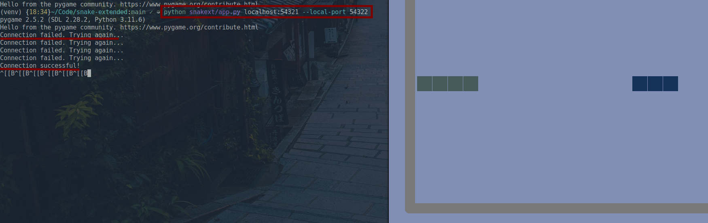

# Project description

## Project name

Snake multiplayer (snake-extended)

## List of group members

Joren Štekeļs, registration no.: js21283

## Brief description of the program (what the program does)

The program is a classic snake game. Both individual games and a game for two
through a computer network, which was implemented in a P2P model. Communication
is implemented with "websockets" library and game functionality is implemented
with using the "pygame" library.

The object of the snake game is to get as big a snake as possible by collecting
foods that are placed on the field of play. The game ends if the snake touches
the body of any snake.

## Instructions on how to run your program

Get the source code repository, for example by cloning it from the github
repository.

``` $ git clone https://github.com/jorenchik/snake-extended $ cd
./snake-extended ```

Create a virtual Python environment (optional).

``` $ python -m venv venv ```

Activate python virtual environment.

Linux/Unix: ``` $ source ./venv/bin/activate ```

Windows: ``` $ source .\venv\Scripts\activate ```

Install ``poetry'' to get the necessary packages. ``` $ python -m pip install
poetry $ python -m poetry install ```

Alternatively, required packages can be obtained from "requirements.txt". ``` $
pip install -r requirements.txt ```

Run the program in single player mode. ``` $ python snakext/app.py ```

To run the program in 2-player mode, the following arguments must be specified:
sockets, local server port (optional). For example, let's connect to a socket
localhost:54323 starting the local server on port 54322. ``` $ python
snakext/app.py localhost:54323 --local-port 54322 ```

The default port is 54321. So: ``` $ python snakext/app.py 192.168.8.3 ``` I
would connect to 192.178.8.3:54321 and start the server on port 54321.

## Screenshots showing the program in action

Single player mode

 

Two player mode. Joining is done at first. If it is successful a handshake is
performed and the game begins similar to single player mode.

 

## Link to the project's GitHub (Gitlab, etc.) repository

The project repository can be found
[here](https://github.com/jorenchik/snake-extended).
