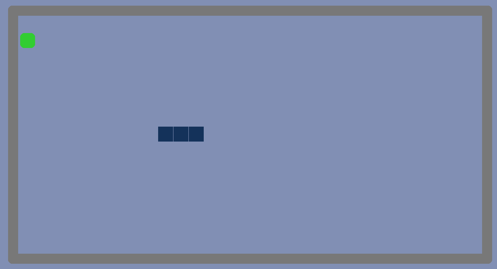
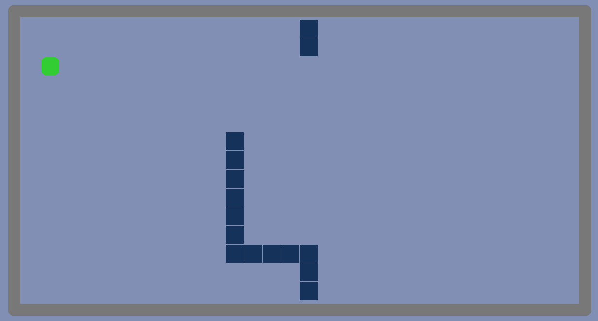
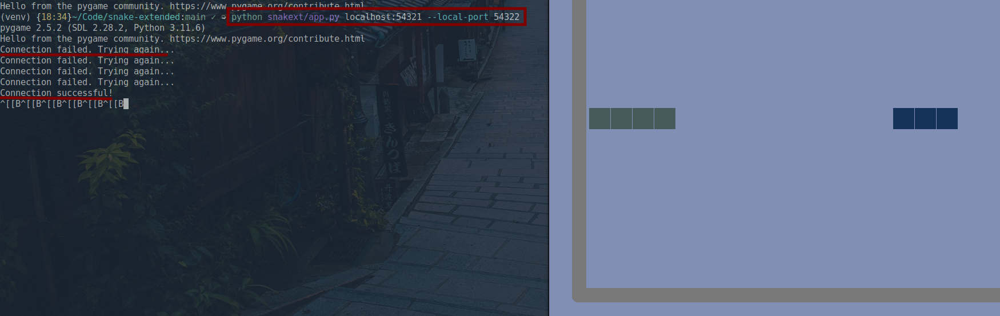
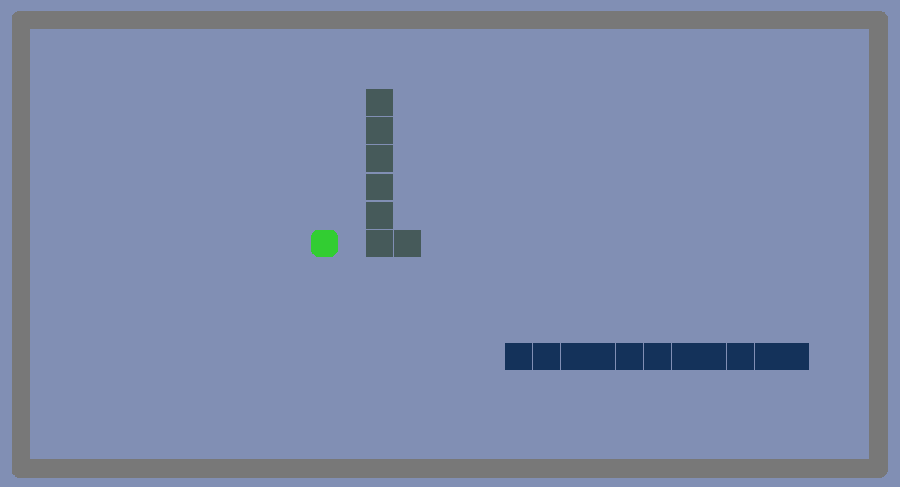

# Snake (Extended) 

## Projekta nosaukums

Snake multiplayer (snake-extended)

## Grupas dalībnieku saraksts

Jorens Štekeļs, apl.nr.: js21283

## Īss programmas apraksts (ko programma dara)

Programma ir klasiska čūskas spēle. Ir pieejama gan individuāla spēle,
gan spēle divatā caur datoru tīklu, izmantojot P2P modeli. Komunikācija ir
realizēta ar ``websockets'' bibliotēku un spēles funkcionalitāte ir realizēta ar
``pygame'' bibliotēkas palīdzību.

## Instrukcijas, kā palaist Jūsu programmu

Iegūt pirmkoda repozitoriju, piemēram, klonējot to no github repozitorija.

```bash
git clone https://github.com/jorenchik/snake-extended 
```

Izveidot virtuālo Python vidi (nav obligāts).

```bash
python -m venv venv
source ./venv/bin/activate
```

Instalēt ``poetry'' atkarību intalēšanai.

```bash
python -m pip install poetry 
```

Instalēt projekta atkarības (dependencies).

```bash
python -m poetry install 
```

Palaist programmu viena spēlētāja režīma.

```bash
python snakext/app.py 
```

\pagebreak
Lai palaistu programmu 2 spelētāju režīmā ir jā norāda argumenti: sockets,
lokālā servera ports (neobligāts). Piemēram pieslēgsimies pie socketa
localhost:54323 ar lokālo serveri portā 54322.

```bash
python snakext/app.py localhost:54323 --local-port 54322
```

## Ekrānuzņēmumi, kas parāda programmu darbībā

Viena spēlētāja režīms




Divu spēlētāju režīms. Sākumā notiek pievienošanās. Ja tā ir veiksmīga
tiek veikts rokasspiediens un sākta spēle līdzīgi kā viena spēlētāja
režīmā.




## Saite uz projekta GitHub (Gitlab, u.tml.) repozitoriju

Projekta repozitorijs ir atrodams [šeit](https://github.com/jorenchik/snake-extended).

